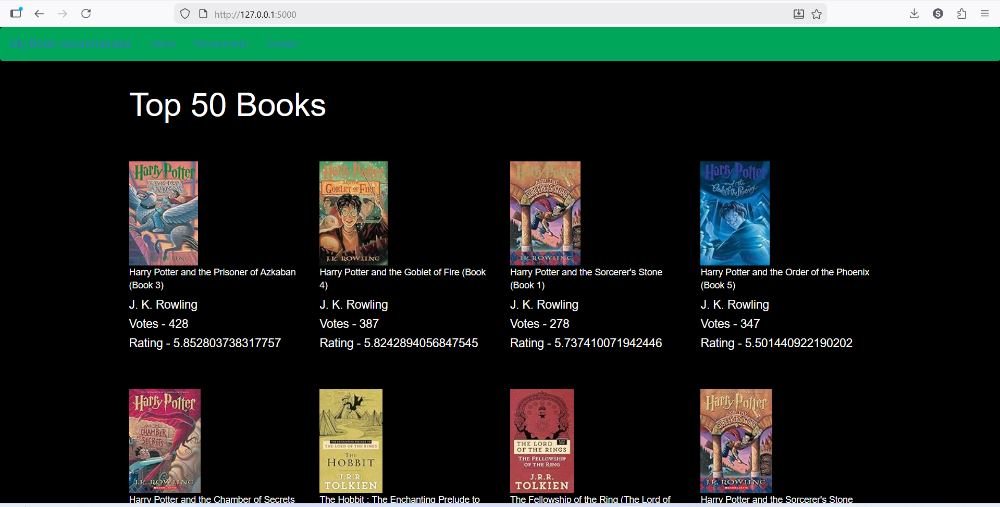
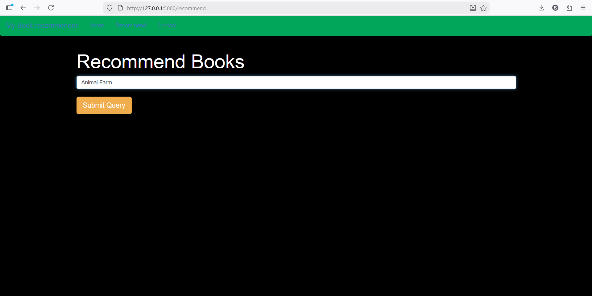
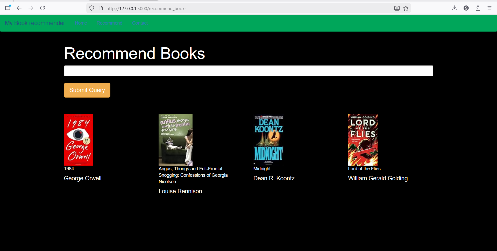

# 📚 Book Recommender System (Flask Web App)

This project is an end-to-end **Book Recommendation System** built using
Python and Flask. It recommends books based on user input using Cosine
Similarity and collaborative filtering concepts.

The system also displays the **Top 50 Popular Books** on the homepage,
providing a real-world simulation of how platforms like Amazon or
Goodreads recommend books.

------------------------------------------------------------------------

## 🚀 Project Highlights

-   End-to-end recommendation workflow (data preprocessing → similarity
    modeling → web deployment)
-   Collaborative filtering using pivot tables
-   Cosine similarity for recommendation scoring
-   Top 50 popular books displayed on homepage
-   Flask-based web application
-   Clean UI with book images and author details

------------------------------------------------------------------------

## 📌 Core Features

### 🏠 Home Page

Displays Top 50 popular books based on: - Number of ratings - Average
rating - Book title - Author name - Book cover image

### 🔎 Recommendation System

-   User enters a book name
-   System finds similar books using cosine similarity
-   Returns top recommended books with:
    -   Title
    -   Author
    -   Book cover image

------------------------------------------------------------------------

## 🧠 Recommendation Methodology

The system uses **Collaborative Filtering**.

### Pivot Table

A pivot table is created with: - Book-Title as index - User-ID as
columns - Book-Rating as values

This creates a user-book interaction matrix.

### Cosine Similarity

Cosine similarity is used to measure similarity between books based on
user ratings.

Why cosine similarity? - Works well with sparse matrices - Suitable for
recommendation systems - Measures angle similarity rather than magnitude

------------------------------------------------------------------------


## ▶️ How to Run the Project

### 1️⃣ Clone the Repository

``` bash
git clone https://github.com/shubro-das/Collaborative-book-recommender-using-Clustering-technique-.git
cd Collaborative-book-recommender-using-Clustering-technique-
```

### 2️⃣ Install Dependencies

``` bash
pip install -r requirements.txt
```

### 3️⃣ Run the Flask App

``` bash
python app.py
```
------------------------------------------------------------------------

## 🖥️ Application Preview

Screenshots of the home page, recommendation interface and outputs:
### 🔹 Home Page with TOP 50 Popular Books


### 🔹 Recommendation UI


### 🔹 Top 4 Recommended Books


------------------------------------------------------------------------

## 📊 Dataset

The project uses a book dataset containing:

-   Book details (title, author, image URL)
-   User information
-   Book ratings

The datasets were cleaned and processed to build the recommendation
system.

------------------------------------------------------------------------

## 🛠️ Tech Stack

-   Python
-   Pandas
-   NumPy
-   Scikit-learn
-   Flask
-   Pickle
-   Cosine Similarity

------------------------------------------------------------------------

## 🎯 Purpose of the Project

This project demonstrates:

-   Building a collaborative filtering recommendation system
-   Working with pivot tables and sparse matrices
-   Applying cosine similarity for similarity scoring
-   Model serialization using pickle
-   Deploying ML logic using Flask
-   Designing a basic recommendation UI

------------------------------------------------------------------------

## 👨🏻‍💻 Author

Shubro Das\
GitHub: https://github.com/shubro-das
